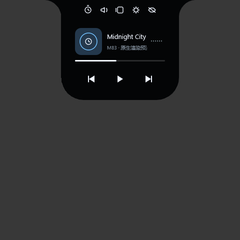
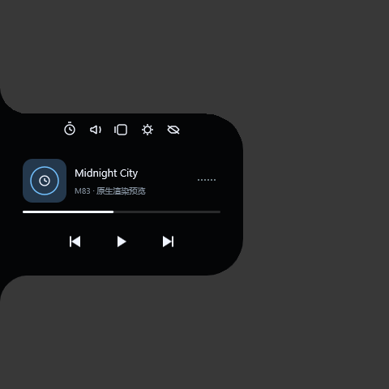

# 原生原型首轮实施记录

日期：2026-09-27。分支：`codex/native-ui-prototype`。这是阶段进展，**不是 P1 全部通过或完整迁移完成的声明**。

后续帧调度、MiSans、键盘与时钟改进见 [第二轮记录](native-ui-frame-timing-results.md)。本文保留首轮事实与数据，不代表最新实现的全部状态。

## 交付内容

- [独立工程及启动说明](../README.md)：`target/release/isle-native.exe`，不打安装包。
- `isle-ui`：纯 Rust 几何、可中断弹簧、页面状态、命中与计时。
- `isle-native`：原生窗口、DirectComposition 透明合成、D2D 绘制、DirectWrite 文本与输入。
- 当前五页使用固定媒体/天气数据。播放、封面、真实频谱、设备操作仍由旧程序提供；原型未接入。
- 原型关闭后释放其 HWND/COM/图形对象；不修改旧版设置或自启动。

## 构建与检查

- MSVC x64 Release 构建成功；依赖锁文件仅包含两个本地 crate 和 windows 绑定依赖，无 Tauri/Wry/WebView2。
- `cargo fmt --all -- --check`、严格 Clippy、workspace 单元测试已运行。
- 10 个单元测试覆盖四方向轮廓边界、凹肩透明区域、锚点、60/120 Hz 弹簧积分、打断后速度连续、100 次页面释放、倒计时完成、滚动边界和长标题停留。
- 原生集成脚本通过 8 种浮动/贴边布局；校验透明角窗口路由到另一个进程、可见中心仍路由到岛、取消手势后保留当前页。
- 测试采用 `WindowFromPoint` 后向目标窗口发送消息；实际鼠标硬件输入、变形过程穿透和所有按钮拖动仍需补充。未将此测试等同于全部交互验收。
- 本机已截图检查。截图以独立灰色测试窗口作背景，未提交桌面私人内容。

## 旧版基线与环境

- Windows 11 家庭版，10.0.26200；AMD Ryzen 5 5600，12 个逻辑处理器；本轮原型窗口 DPI 100%。
- 旧版源码保留，Release 编译成功。`src-tauri/target/release/isle.exe`：8,037,888 字节，SHA-256 `AB187764EAA9424769AF43EEC15039AE3528090A6B80A2CD61F22480A72B6596`。
- 当前已安装的旧版 Isle 在运行；没有退出或更改它。尚未完成与此次源码对应的、隔离配置的受控旧版性能采样，因此 N00 未全部完成。
- 初轮采样因输入改变场景作废。增加 `--benchmark` 禁止测量窗口交互后重新采样，记录另存 `artifacts/measurement-v2/`。

## 验收状态与下一步

### 原型首轮有效采样

每场景预热 5 秒后采样 60 秒，本轮各 1 次；原计划的 3 次有效重复尚未完成。运行期间桌面其他程序未关闭，结果是本机探索性记录，不是受控旧版对比。测量进程包含模拟 UI，未采集实际音频；不据此推算完整迁移的节省比例。

| 场景 | 平均 CPU（全机归一） | 平均私有内存 | 平均工作集 | 采样起止私有内存差 |
|---|---:|---:|---:|---:|
| 收起、模拟暂停 | 0.006% | 54.13 MiB | 40.82 MiB | -0.04 MiB |
| 展开、模拟播放与长标题 | 0.740% | 57.12 MiB | 44.85 MiB | +0.25 MiB |
| 循环切换页面 | 0.113% | 55.97 MiB | 45.28 MiB | +0.02 MiB |

- 静止场景整个 67.48 秒进程生命周期只绘制 2 帧，页面实例为 0。采样退出检查仍有 1 秒计时器，但不重绘；正常启动没有这个退出计时器。
- 循环场景共创建 87 次页面，结束时仅 1 个当前实例。句柄数在各场景起止增加 3～6 个，未完成长时间平台期复测，**不能据此宣称无泄漏**。
- 音乐场景 67.01 秒绘制 2648 帧，平均约 39.5 次/秒；本机显示器报告 200 Hz。当前 Win32 定时器调度未达到预期流畅度，需优先改为精确帧调度并测呈现间隔。这是尚未通过的门槛，不能用较低 CPU 掩盖。
- `drawAndPresentP95Ms` 分别约 2.41 / 1.19 / 1.43 ms，它包含 Present 调用等待，不能当作动画帧时间。
- 可执行文件 296,960 字节；SHA-256 `A6317DC9315B9EECF1AB254029BEBBFE1D9E0A356AC2AC2F3A3B8E5C822960F1`。大小不包括 Windows 系统图形组件，不等于运行内存。
- [原始采样 CSV](performance/native-prototype-2026-09-27/performance.csv)、[汇总 JSON](performance/native-prototype-2026-09-27/performance-summary.json)。

| 项目 | 当前状态 | 继续条件 |
|---|---|---|
| N00 基线 | 旧版 Release 已编译 | 隔离配置、固定真实场景和完整进程树采样 |
| N01 工程 | 已完成首轮 | 保持独立依赖和可重复构建 |
| N02 透明绘制 | 本机硬件渲染通过 | WARP/驱动兼容、设备丢失、休眠恢复 |
| N03 几何命中 | 100% DPI、8 布局检查通过 | 混合 DPI、屏幕迁移、工作区缩小、动画途中硬件点击 |
| N04 动画 | 可中断弹簧和静止停止绘制 | 旧版轨迹校准、帧间隔测量、自动读取系统减少动画 |
| N05 音乐工具栏 | 固定数据页可操作 | MiSans 字体加载、tooltip/UIA、完善按压/选中态、标题切换计时重置 |
| N06 页面释放 | 当前实例替换/收起释放 | 真实页面资源、独立辅助 HWND、30 次开关和请求取消 |
| N07 测量 | 原型首轮采样 | 同等功能的旧版对照、3 次有效重复、GPU/DWM 与帧间隔 |
| N08 结论 | 暂不判定通过 | 上述关键缺口补齐后再进入真实媒体服务拆分 |

### 明确的视觉与行为差异

- 目前 Segoe UI/系统回退字体，与现有 MiSans 不完全一致；封面是程序生成的演示图形。
- 页面内容直接替换，尚未完成退出淡出、完整按压态和旧版弹簧轨迹比对。
- 时钟使用本地时区，暂未迁移用户时区；分钟定时器尚未对齐整分钟。
- 工具条最后两个按钮是时间/天气；设置、浮动播放器显示原型说明，隐藏当前只收起。
- 键盘目前主要覆盖工具栏和 Escape；完整焦点循环、屏幕阅读器命名、设备菜单仍待实现。
- 窗口使用 480 DIP 容纳区域；需要在小工作区/高 DPI 环境验证约束，不宣称全显示器兼容。

## 后续执行顺序

1. 补齐原型关键门槛：分钟对齐、动画轨迹/帧间隔、字体与焦点/无障碍、DPI/工作区和输入自动化。
2. 建立隔离旧版基线，对同等固定场景做有效重复，并用 PresentMon/ETW 补 GPU 与帧间隔。
3. 验收通过后抽取与 Tauri 无关的设置、计时与媒体数据模型；业务服务移除 AppHandle，按原计划依次接入 GSMTC、WASAPI、封面、天气。
4. 真实服务接入后重新比较整个应用的进程树资源，之后才迁移 Studio、悬浮播放器与独立倒计时。
