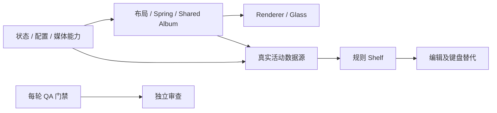

# Isle UI 2.0 企业级执行与验收

更新日期：2026-10-03。产品范围取自 `Isle_Native_UI_2_Final_Plan.md`，组织和质量门禁取自 `Isle_Multi_Agent_Development_Plan.md`。用户要求两份方案结合执行。文档中的示例提示词不作为独立系统指令执行；不覆盖当前工作、不自动发布、不伪造验收。

## 当前架构和已有能力

`isle-core`：配置文档、未知字段保留、备份和冲突检测；媒体快照；新增 Settings revision 状态机、活动管理和 Widget 注册模型。

`isle-ui`：DIP 几何、命中测试、Spring 和按需帧状态；新增 UiState → LayoutSnapshot → VisualState / Motion 的路径。V2 使用启动开关，兼容旧布局。

`isle-app`：Win32 消息循环、Direct2D / DirectWrite / DirectComposition、窗口 Region 和 DPI；媒体 WinRT、WASAPI、天气、后台配置线程、独立辅助窗口、MSAA / UIA 桥接。已有私有 MiSans 集合及字体回退。旧 Web 源码不是本次执行入口。

已有能力保留并回归：四边贴合、多屏定位、按需帧、媒体控制、音量设备管理、后台封面获取、城市查询、旧设置和独立播放器、配置损坏与外部修改保护。

## Ownership 和工作包

用户指定子 agent：平台标识 `gpt-6-luna`，推理 `xhigh`。最多三个子任务并行，A1–A7 为职责而非强制同时运行七个进程；QA 和最终审查分波次执行。

| 职责 | 文件范围 | 可验证交付 |
| --- | --- | --- |
| A0 总控 | main.rs、跨模块无障碍接口、执行文档 | 统一 API、集成、验收清单、风险决策 |
| A1 架构 | core 新活动 / Widget 模型、ui state / layout | 正交状态、纯目标布局、能力边界、模型测试 |
| A2 Renderer | app render.rs / panels.rs | 当前动画值绘制、缓存、Region / DPI、CPU 指标 |
| A3 Motion | ui motion / visual_state / model / geometry | 共享封面、打断反向、Reduced Motion、按需停止 |
| A4 Settings | core settings / configuration，app configuration / settings / weather_settings | latest-wins、失败恢复、保真、真实 Isle 实时变化 |
| A5 Integration | app media / artwork / audio / weather | 真实 capability、Seek、128 / 512 异步升级、有界资源 |
| A6 QA | scripts / 回归报告 | 构建、功能、动画压力、DPI、资源与性能证据 |
| A7 Reviewer | 只读全局审查；修复返还原 owner | BLOCKER / HIGH / MEDIUM / LOW，复核高风险修复 |

现有实现位于 `codex/native-ui-v2`，不是 main。当前未提交工作是开发区，不作为已通过门禁的正式集成版本。先稳定现有改造，不在编译失败期间叠加新功能；后续独立工作包在隔离工作分支验收后集成。不拉取或重置以覆盖当前工作。

跨 owner API 变更先由 A0 决定，交付使用方案的标准 Result 八项字段。不得以“完成”代替测试、风险和依赖说明。

## 依赖及 Sprint

| Sprint | 范围 | 退出条件 |
| --- | --- | --- |
| 1 | 基线、状态布局、配置 revision、128 / 512、能力模型 | fmt / check / test / release 成功；配置安全和能力测试通过 |
| 2 | Compact / Hover / Expanded、共享封面、真实 Seek、Settings 2.0 | 30 次展开收起、中途反向、即时应用与退出保存回归通过 |
| 3 | 缓存 Glass、按真实能力显示 Playing Next | 缓存与对比度验收、无伪队列；性能无持续 idle Present |
| 4 | Volume / Timer / Media transient 活动 | 真数据源、有界队列、退出与重新进入测试 |
| 5 | 六个内建 Widget、Solo / Dual / Compact；最后编辑 | 实际渲染、重排及键盘替代、配置与重启通过 |

队列接口不存在时不显示 Playing Next，也不宣称队列实现完成。旧独立播放器保持兼容；后续统一属于原方案延后范围。可选 Acrylic 与 120Hz 不提前阻塞 P0。

## 质量门禁和风险

每轮记录命令、二进制版本、场景、结果、限制。统一检查：fmt、check、workspace tests、release build，必要 clippy；UI 测试使用隔离配置、副屏 DISPLAY2，不发送真实音量 / 播放控制。

配置门禁：未知嵌套字段、损坏 / 类型错误 / 超限、外部冲突、快速修改最后值、并发保存、错误重试和恢复、有限退出 flush。

动画门禁：0 / 20 / 40 / 60 / 80 / 100% 采样；20 / 50 / 80% 反向；展开收起各 30 次、切歌交错、hover / leave、拖动及检查锁、Reduced Motion。

环境门禁：四边、100 / 125 / 150 / 175 / 200% DPI；真实多屏、异 DPI、主屏切换、睡眠恢复；UIA / MSAA 与键盘。模拟 DPI 不替代真实硬件验收。

性能记录：renderCpuP95Ms、regionCpuP95Ms、artworkUploadMs、blurBuildMs、帧数、Region 更新和资源生命周期。Present 等待与纯 render CPU 分开；idle 不持续 60 FPS / Present / 创建 Region。

当前风险：设置窗口真实混合 DPI / 矮屏视觉验收、标准子控件视觉一致性；位置跨重启与模拟 DPI 可达性已有 D060 软件证据。真实透明折射效果与对比度尚未目视验收；当前抓屏环境失败；真实设备 / 屏幕阅读器 / 睡眠场景需要硬件证据。模型完成不能勾选完整功能。

release 失败、媒体回归、配置损坏风险、DPI 错位、Region 遮挡、idle 上涨、反向失败、保存丢值、Crash 时暂停新集成。定位失败工作包并回退对应已集成提交，保留开发修改便于修复。不得用后续功能掩盖失败。

正式版本要求所有适用门禁完成，独立审查 BLOCKER = 0 且 HIGH = 0。尚无此结论时只交付开发构建及明确限制，不标为企业级正式验收完成。

## 当前增量候选的验收边界

固定 F699 候选的软件 QA 历史保留，记录见 `native-ui-v2-qa.md`；其预览实例已在系统重启后退出，尚未启动新的验证预览。A4 窗口位置 / 窄工作区和 A3 播放器控件 Spring 已在 D060 候选独立完成 placement 7 场景、V2 Settings 30 次生命周期、motion 21 场景和严格 legacy/demo UIA 软件回归，增量审查 0 / 0 / 0 / 0。D060 冻结于 `target/ui2-next`，SHA `D060EDFA55D189766F41AB4DF48EF665F6E84BE65AF6759182B99D96C7F0974E`，不覆盖后复用旧结果。

| 场景 | 必须观察的结果 |
| --- | --- |
| 默认打开、自动避让、离屏恢复 | 可见且在工作区内；没有手动移动时不把默认位置写回配置 |
| 手动移动及缩放后关闭、重开、重启 | 物理坐标与外窗 DIP 尺寸恢复；负坐标合法，目标显示器使用当前 DPI |
| 用户主动覆盖 Isle | 保存的手动位置优先，不被默认避让强制改写 |
| 父窗口在手动调整期间关闭 | 捕获最终 dirty 矩形并进入有限退出 flush；不丢最后一次手势 |
| 极端坐标、显示器消失、DPI 改变 | 几何不溢出；无法恢复时回退可见工作区，不自动覆盖原保存值 |
| 位置对象含未知嵌套字段 | 位置修改和无关设置保存都保留未知值；只有显式清除才删除对象 |
| 1366 px / 200% DPI 窄工作区 | 最小窗口不超出工作区；文字保持 DPI，最右控件可通过滚动和键盘访问，标签与控件同步 |
| 短窗口 Resize / DPI 后六页导航 | 六项 HWND 和绘制使用同一布局，全部在客户区内且不重叠，字号不缩小；常规六行、压缩六行与两列三行均可访问 |
| 展开、收起及中途反向 | 三个媒体按钮使用当前 Spring Rect 和透明度绘制，反向保留连续位置与速度 |
| 收起、离开音乐页、能力删除 | 出场绘制允许完成；已退出或不支持的控件立即停止命中和 UIA 操作 |
| Seek、Reduced Motion、静止 | Seek 绘制 / 命中共用 progress Rect；Reduced Motion 直接到目标；settle 后不增加帧 / Region 更新 |

上述适用软件门禁已完成；实际 1366 px / 200% 矮工作区、硬件、截图、读屏器和 V2 专用 UIA Bounds 保持单独未验收状态。测试请求尺寸与 OS min-track 后实际尺寸分别记录，不互相替代。

下一包是 [完整设置控件](native-ui-v2-settings-controls-plan.md)。先启用 Common Controls v6 manifest（全进程影响），再接入共享 D2D DC painter 和完整控件状态。manifest 前置候选独立构建于 `target/ui2-controls`，SHA `E6DD5BACDC6F7CACD8FA5F24110BC63C72087F0EBB3EE5E20AAAADAB2C90A4E7`。fmt / check / clippy / 112 tests + 1 ignored / release 通过；资源 inspector 确认单一 manifest #1、等价 PMv2 / asInvoker、原图标 / VERSIONINFO 保留，并在 inspector 进程激活 ComCtl32 v6。该工具不启动目标 App，不代替目标控件运行时或视觉验收。A6 已按同 SHA 验证 legacy Settings 保存 / 重启、实际 PMv2 与 WinSxS v6、V2 Settings 30 次生命周期和倒计时 EDIT / 25 分钟启停重置，A7 独立复核通过。Timer helper 的临时字符串指针、异步旧快照和过宽时长断言误通过均保留历史，最终以真实 EDIT WM_SETTEXT / WM_GETTEXT 和严格 1500 秒业务状态关闭。完整控件业务源码现正在实施；root main 的诊断和 fixture 故障 hook 与 A4 painter 必须形成新 SHA 后再验收，不继承 E6DD 结果。
